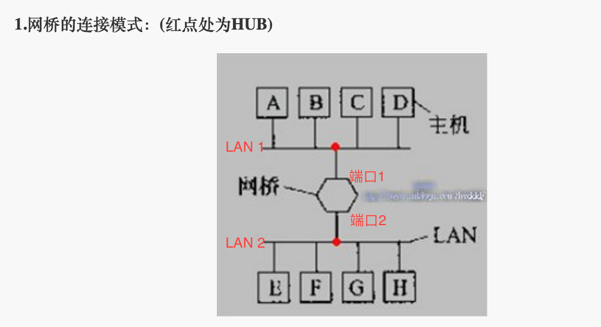
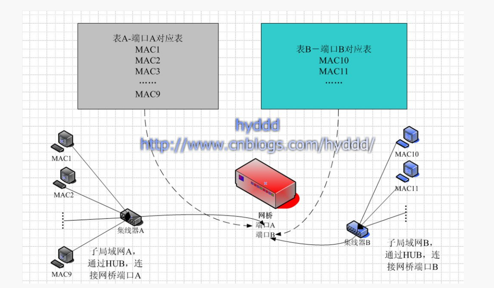
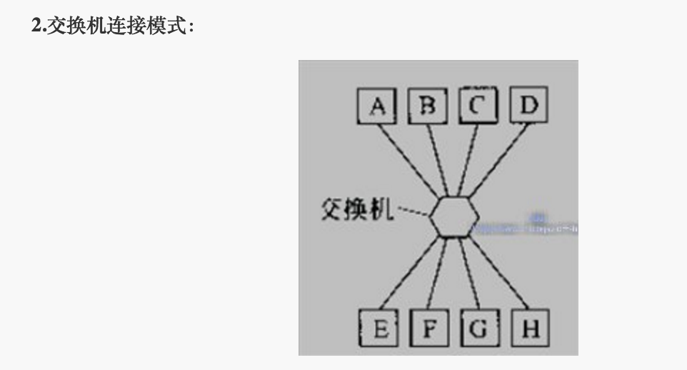

#网桥，网关；集线器，交换器，路由器

基础网络类型：总线型，环形，星型

总线型网络： 
各主机共用信道，容易出现冲突。（CSMA/CD调度协调信道征用，以太网核心）
冲突域：彼此征用同一个信道，可能产生冲突的主机集合
总线型网络中主机过多时，交通拥堵，采用网桥，桥接两个LAN 
###网桥，集线器，交换器

注意图中红点为集线器（hub）,其内部实际上可以看做是一根总线，实际上图中ABCD连接到集线器和ABCD连接在一条总线上没有区别(集线器也有中继器的功能，可以将接收到的信号放大，扩大网络传输距离)。网桥只有两个端口，分别连接到两个集线器上 

为什么我们需要网桥？ 

例如对于A-H这8台主机，如果不使用网桥，全部连在一条总线上，则8台主机抢用一个信道。并且所有在总线上传输的数据，8台主机均可以看到，也存在安全风险。网桥将网络分段，在两个相似网络中同时起到了连接与隔离的作用，同时缓解了网络拥堵。 

具体的原理是，网桥内部维护了一张表格记录MAC地址与网桥端口的对应关系，到达网桥的数据只会从其目的MAC地址对应的网桥端口流出。例如A向D发送数据，网桥发现D的MAC地址对应的端口不是端口2则EFGH所在的总线不会承受A->D数据包的流量压力（自动弃包，减少广播风暴）。
即LAN 1内部主机间的通信不会占用LAN 2的总线，从而缓解拥堵。同样的如果是A向E发送信息，由于目的MAC地址与端口2绑定，因此E也能正常收到信息，从而实现不同网段之间的网络通信

需要注意的是， 网桥内部维护的表格最初是如何生成的？最开始的时候网桥中的表格是空的，然而随着网络通信的开始表格逐渐被填充。例如，上图中MAC1想要和MAC10通信，由于并不知道MAC10在哪，数据包会以广播的形式发送，当数据包从端口A到达网桥时，由于数据包包含其来源的MAC地址MAC1,于是网桥中的表格填入一条新记录将MAC1与端口A绑定，同时继续将数据包向端口B广播。

那么网桥和交换器又有什么区别呢？实际上可以将交换器看做是多端口的网桥。

不同点在于，交换器有多个端口，CAM表格中每个端口和MAC地址是一一对应的关系，而网桥维护的表格一个端口和多个MAC地址对应。如果在交换器的CAM表中已经将某个端口与某个MAC地址绑定，但此时从该端口又来了另一个MAC地址的数据包，那么交换器会直接更新表格将该端口与新的MAC地址绑定。然而同样的情况对于网桥，则仅仅只会增加一条新的记录，原记录依然保留（因为网桥可以一对多）。

另外补充一下集线器与交换器的另一个区别，集线器是半双工，同轴线缆（对讲机），交换器是双工，双绞线（手机）；集线器作用是扩充局域网的范围，交换器作用是将局域网分成更多网段（或者连接多个子局域网），缓解广播风暴和交通拥堵，

###网关，路由器
网关和路由器相比前面介绍的集线器，网桥，交换器有较大不同，它们工作在不同层次上。集线器工作在物理层和数据链路层，网桥，交换器主要工作在数据链路层或者更高层，而网关和路由器主要工作在网络层；网桥和交换器主要操作MAC地址，而网关和路由器则是根据IP地址来工作；网桥和交换器只能分割冲突域，局域网网段，其连接的网段仍属于同一个广播域，而网关和路由器可以连接WAN，广播数据不会穿过路由器，路由器仅仅转发特定地址的数据，不会传送未知目标地址的数据（即广播)；路由器速度较慢且价格昂贵。

参考博文 
[网络基础之网桥和交换机的工作原理及区别](http://network.51cto.com/art/201107/277187.htm) 
[集线器、交换机、路由器、网桥、网关之间的区别](http://www.cnblogs.com/imapla/archive/2013/03/12/2955931.html)