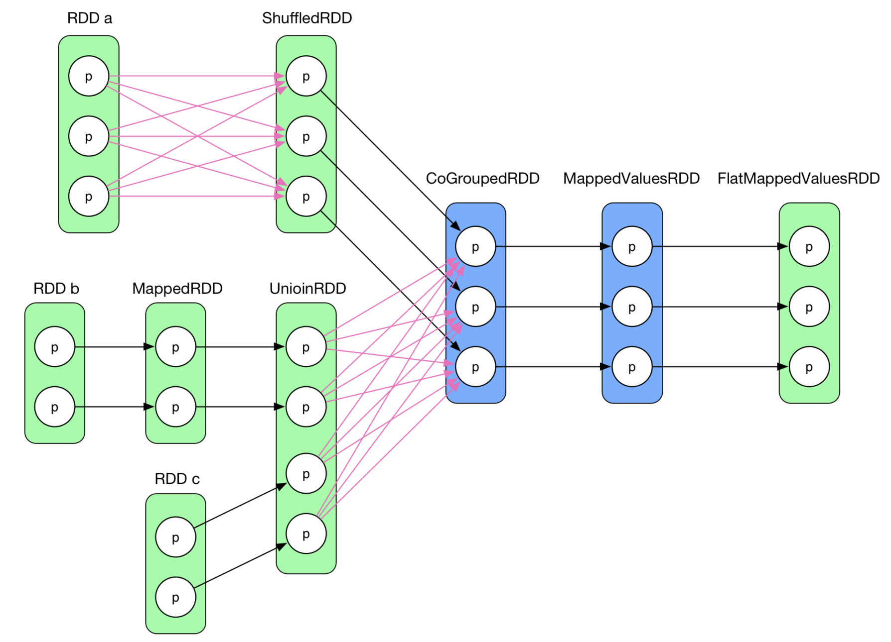
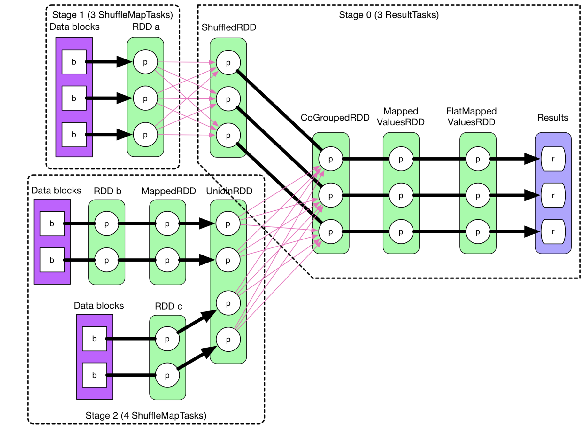

### Stage划分 & Pipeline


上一篇笔记[RDD & Dependency概念 & 宽窄依赖划分](./RDD & Dependency概念 & 宽窄依赖划分)提到了宽窄依赖的划分，下面引出另外两个问题：为什么我们需要区分宽窄依赖？

为什么我们需要区分宽窄依赖？
划分宽窄依赖是构成DAG的基础，主要起到了以下作用:  
1、宽窄依赖有助于stage的划分，通过stage的划分以及DAG的处理逻辑使Spark为迭代式数据处理提供了更好的支持  
2、宽窄依赖的划分对Spark的容错机制也有重要作用（后续笔记[Spark容错机制](./Spark容错机制)会详细讨论）

对于第一点作用，我们需要进一步考虑的是为什么要划分stage。首先明确一个前提：一个stage是由多个并行的tasks组成的。

一个job包含了多个计算逻辑（比如某个job的计算逻辑：map -> union -> cogroup -> map... ），一个task其实就是一个计算数据的线程，它会在一部分数据上执行计算逻辑，我们可以选择让一个task执行一个job的所有计算逻辑，也可以将一个job的逻辑划分成不同的阶段，让阶段1的task处理前一部分的计算逻辑，阶段2的task处理后一部分的计算逻辑（这种阶段划分的思想也就是spark中stage的原理）。和MapRedece对应起来，一起MapReduce就是讲所有的job的计算逻辑都划分成两个阶段，先由map阶段的task处理一部分计算逻辑，再给reduce阶段的task执行后一部分计算逻辑。而Spark的设计更为灵活，它将一个job的计算逻辑划分为更多的计算阶段，并且以宽依赖（shuffle）为阶段的划分依据，这样每个job会由多个迭代的stage组成，每个stage会由多个并行的task组成，stage和stage之间是串行关系（举个例子，stage A和stageB之间是串行关系，stage A内部的task A1和task A2是并行关系，stage A的task A1 和 stage B的task B1是串行关系）。

言归正传，这样划分阶段（stage）的好处是什么？  
实际上对于类似spark的分布式计算框架而言，最终的设计目的都是为了提高计算效率。所以不管是shuffle也好，stage的设计也好，DAG也好，都是为了更好地实现这个目的。我们需要设计出一种更合理的job逻辑执行流程以便提高并行度，减少重复计算。  

  
以下面的job举例:
>图片来源[https://github.com/JerryLead/SparkInternals/blob/master/markdown/3-JobPhysicalPlan.md](https://github.com/JerryLead/SparkInternals/blob/master/markdown/3-JobPhysicalPlan.md)
>



这个job包含了多个计算逻辑（包括map,union,cogroup等等），我们当然可以将job的所有执行过程都归于一个stage(即相当于不划分stage，job直接由并行的tasks组成，每个task执行job的所有计算逻辑从头到尾，哪怕中间存在shuffle)

这样第一个task（task1）就会包含以下所有蓝色粗箭头连接的计算逻辑：


显然，这样的设计会有很多问题：  
**最明显的问题是并行度不高**。对于每一个task，凡是遇到宽依赖（shuffle）的逻辑，就必须计算集群几乎所有的数据（paritition）。然而一个集群通常要处理庞大的数据量，将所有的数据交给集群中的一个task(一个线程)来处理显然不合适。如果将job的执行逻辑按照宽依赖来划分不同的stage则每个task内部不会涉及shuffle，这样每个task就只用处理一部分数据而非集群中的所有数据，可以有效地提高并行度，提高集群的利用效率。

有些人可能会考虑到shuffle前的RDD可以cache，这样就只有第一个task才需要计算集群所有的数据，而其他并行的task只需要计算shuffle后面的计算逻辑即可，也就不需要计算所有数据了。如下图，task1计算蓝色箭头的计算逻辑，并缓存RDD a和UnionRDD，并行的task2就只用计算所有红色箭头的计算逻辑了。


首先，task2,task3看似节省了一些重复计算，并且task1 和 task2，task3理论上是并行的，然而这样依然会带来很大的问题。实际上task2, task3必须等task1计算完RDD a以及UnionRDD才真正开始和task1并行计算，实际上前面的一段计算逻辑只有task1这一个线程在计算集群所有数据，并行度并不高。其次，上图仅是某个job的计算逻辑示例，试想，如果某个job的最后两个RDD之间是宽依赖，则除了最后一个RDD的计算是并行以外，前面所有的RDD都必须依赖task1来计算，根本没有并行可言。

下面再对比一下按照宽依赖来划分stage时task的并行情况：



>注意，这张图每一个黑色粗箭头代表一个task,因此这张图涉及到10个task（并行和串行一共10个task），注意和之前几张图区分，前面几张图是用多个箭头组合表示一个task,这张图使用一个箭头表示一个task

可以看到，利用宽依赖划分stage后每个stage内部的tasks是严格并行的，并且每个task确定只会处理一部分数据，不会出现某个task处理整个集群所有数据的情况，大大提高了集群的并行度

下面又会产生一个新的想法：既然利用宽依赖来划分stage可以提高task的并行度，提高集群的资源利用率以及数据处理效率，那么假如将stage更细粒度地划分（即每个task含更少的计算逻辑，更加夸张一点，将之前图中每个蓝色箭头作为一个task，而不是所有蓝色箭头合成一个task）是不是可以让并行度进一步提高进而提升集群的效率？

答案显然是不会提高集群效率，只要有以下两方面原因：
1、由于每个task是一个线程，每个线程执行完之后，它所处理的结果必须cache到内存或者磁盘才能被后续串行的task继续处理。如果task划分过细，则会使task数目大量增多，会有更多的中间数据需要空间来保存。
2、实际上并行度也并不会提高。因为之前按照宽依赖划分stage已经可以达到stage内部task绝对并行了。现在更加细致地划分stage只会提升串行的迭代次数而不会增加并行度

实际上将窄依赖连接的RDD划分到同一个stage(即用每个task处理所有窄依赖连接的计算逻辑)可以充分利用pipeline优化。整个job的执行过程可以类比fork/join的过程，每个stage的开始意味着fork，即fork出多个并行的task线程，而当stage结束的时候会进行join，等stage内部所有的task线程都执行完以后，再进入下一个stage继续fork/join的过程。如果将每一个窄依赖单独划分成一个stage，则会产生过多join，而join是一个全局barrier，会被最慢的task所拖累。因此将连续的窄依赖合并到同一个stage中可以将多个fork和join合并为一个，既可以减少全局barrier，又可以减少中间结果的物化（cache到内存或磁盘），从而提高效率。（注意，如果按照宽依赖划分stage，则每个stage的task数目和该stage最后一个RDD的partition数目相同）

所谓的pipeline思想是指“the data is computed only if they are actually needed in a flow fashion”，听起来很抽象。实际上结合一些源码，还是可以理解的。
> from Class MappedRDD

```
 override def compute(split: Partition, context: TaskContext) =
    firstParent[T].iterator(split, context).map(f)
```
如上方代码所示，在计算MappedRDD时实际上是调用了first parent RDD的iterator,进一步跟踪
> from Class RDD

```
 final def iterator(split: Partition, context: TaskContext): Iterator[T] = {
    if (storageLevel != StorageLevel.NONE) {
      SparkEnv.get.cacheManager.getOrCompute(this, split, context, storageLevel)
    } else {
      computeOrReadCheckpoint(split, context)
    }
  }
```
再查看computeOrReadCheckpoint
>from Class RDD

```
  private[spark] def computeOrReadCheckpoint(split: Partition, context: TaskContext): Iterator[T] =
  {
    if (isCheckpointed) firstParent[T].iterator(split, context) else compute(split, context)
  }
```
也就是说first parent RDD 又调用了它的parent RDD的iterator方法。由此看来compute方法是不停地嵌套，一直回溯到其真正依赖的输入rdd(如NewHadoopRDD等)，找到该task真正依赖的输入parititions才会真正开始计算。这也就是pipeline思想中数据只有在真正需要用的时候再算的含义。同时，从这几段源码中我们也可以看到，如果连续的窄依赖过多可能会导致compute嵌套过深，从而导致栈溢出。这里只提到一对一的窄依赖的pipeline，对于上一篇笔记提到过的多对一的窄依赖该如何进行pipeline呢？

以下图为例


这是典型的多对一的窄依赖，利用pipeline回溯流动到需要计算的位置即该task真正依赖的输入partition，得到第一个task会输入两个partitions(partition x和partition y)，最后算出partition z。由于读取这两个partition以及计算的过程都是在同一个task内完成的，故不会存在shuffle的问题（shuffle表现在某task通过网络拉取其他task生成的结果）。


在之前的笔记[RDD的概念理解](./1-RDD的概念理解)中有结合源码总结过，实际上records的处理是一条条来处理的，并且每条数据执行完窄依赖连接的所有算子之后才会执行下一条数据。这种处理方法对比于每一个算子都计算完parititon中所有的records再进行下一个算子的计算有如下好处：
>第一种处理方式

```
val result = null
for (record <- records) {
  result.add(g(f(record)))
}
```
>第二种处理方式

```
def f(records) {
  var result
  for (record <- records)
    result.aggregate(process(record)) // need to store the intermediate result here
  result.iterator // return the iterator of newly-generated [record1, record2, record3]
}

def g(records) {...}

val fResult = f(records)
val Result = g(fResult)
```
第一种方式中间数据不用保存，内存占用相对少。第二种则需要在内存中保存中间数据。


References:
[http://smallx.me/2016/06/07/spark%E4%BD%BF%E7%94%A8%E6%80%BB%E7%BB%93/#u6570_u636E_u52A0_u8F7D_u4E0E_u4FDD_u5B58](http://smallx.me/2016/06/07/spark%E4%BD%BF%E7%94%A8%E6%80%BB%E7%BB%93/#u6570_u636E_u52A0_u8F7D_u4E0E_u4FDD_u5B58)
[https://github.com/JerryLead/SparkInternals/blob/master/markdown/3-JobPhysicalPlan.md](https://github.com/JerryLead/SparkInternals/blob/master/markdown/3-JobPhysicalPlan.md)