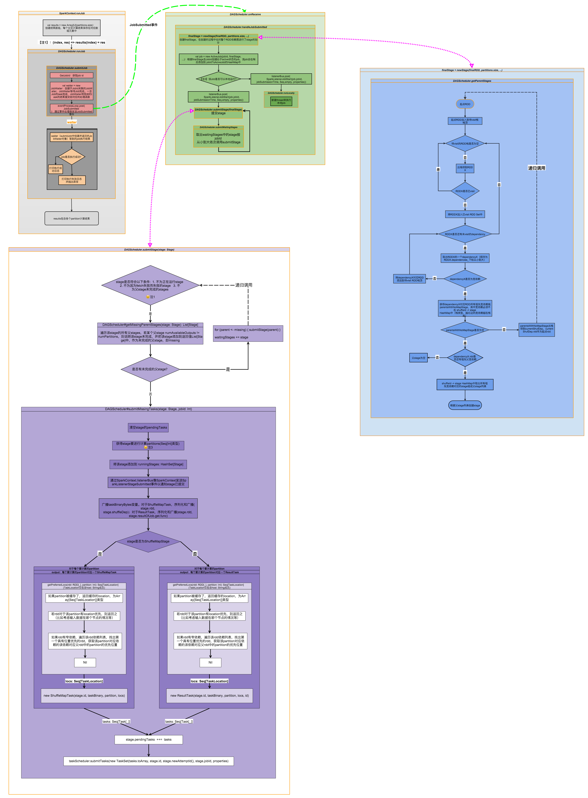

##Stage的生成以及DAGScheduler对Job的处理
>所有代码均来自spark 2.0.0-preview源码

分析Job的提交源码之前，先简单回顾一下DAGScheduler的作用（对于DAGScheduler的功能性介绍参见另一篇笔记[Spark基础与运行架构分析](../Spark基础及运行架构分析)）

DAGScheduler是一个比较高层的调度器，主要面向stage的调度。它会为每一个job计算出stage的DAG(Directed Acyclic Graph)

####DAGScheduler主要功能：  
*1. 接受job提交*  -->runJob  
*2. 根据RDD的依赖关系（宽依赖）划分和构建stage,计算DAG，确定stage的提交顺序*  --> getMissingParentStages + submitStage + submitWaitingStages  
*3. 跟踪RDD和stage的输出是否被物化（物化即cache、persist），并根据当前的物化情况，决定task的最佳执行节点，并将该信息传递给底层的TaskScheduler*  --> submitMissingTasks  
*4. 找到一个代价最低的调度来执行job*   
*5. 将tasksets提交给底层的taskScheduler使得taskset在cluster上运行*  -->submitMissingTasks  
6. 处理shuffle ouput file loss导致的异常，并重新提交丢失输出的stage(stage内部的非shuffle file loss导致的failure是由TaskScheduler来处理的，其将在取消整个stage之前重试几次tasks)  
（斜体的功能为本篇涉及到的功能，符号“-->”后面的内容表示功能点的实现函数）

####DAGScheduler对Job的处理
下面是一个常见的触发job提交的spark客户端代码片段：

```
 sorted.saveAsNewAPIHadoopFile[OutputFormat](outputFile)
```
类似上述提交job的过程最后一般都会触发SparkContext类的runJob方法，我们跟踪一遍提交Job的大体调用流程来分析stage的生成与提交：    
1、SparkContext的实例sc调用runJob方法，内部调用DAGScheduler的runJob方法  

>from Class SparkContext

```
  /**
   * Run a function on a given set of partitions in an RDD and pass the results to the given
   * handler function. This is the main entry point for all actions in Spark.
   */
  def runJob[T, U: ClassTag](
      rdd: RDD[T],
      func: (TaskContext, Iterator[T]) => U,
      partitions: Seq[Int],
      resultHandler: (Int, U) => Unit): Unit = {
    if (stopped.get()) {
      throw new IllegalStateException("SparkContext has been shutdown")
    }
    val callSite = getCallSite
    val cleanedFunc = clean(func)
    logInfo("Starting job: " + callSite.shortForm)
    if (conf.getBoolean("spark.logLineage", false)) {
      logInfo("RDD's recursive dependencies:\n" + rdd.toDebugString)
    }
    //重点：调用了DAGScheduler的runJob方法
    dagScheduler.runJob(rdd, cleanedFunc, partitions, callSite, resultHandler, localProperties.get)
    progressBar.foreach(_.finishAll())
    rdd.doCheckpoint()
  }
```

2、DAGScheduler.runJob调用DAGScheduler.submitJob(),submitJob会创建JobSubmitted event发送给内部类eventProcessLoop，这一步实现了DAGScheduler的第一个功能点：提交Job
>from Class DAGScheduler

```
  def submitJob[T, U](
      rdd: RDD[T],
      func: (TaskContext, Iterator[T]) => U,
      partitions: Seq[Int],
      callSite: CallSite,
      resultHandler: (Int, U) => Unit,
      properties: Properties): JobWaiter[U] = {
    // Check to make sure we are not launching a task on a partition that does not exist.
    val maxPartitions = rdd.partitions.length
    partitions.find(p => p >= maxPartitions || p < 0).foreach { p =>
      throw new IllegalArgumentException(
        "Attempting to access a non-existent partition: " + p + ". " +
          "Total number of partitions: " + maxPartitions)
    }

    val jobId = nextJobId.getAndIncrement()
    if (partitions.size == 0) {
      // Return immediately if the job is running 0 tasks
      return new JobWaiter[U](this, jobId, 0, resultHandler)
    }

    assert(partitions.size > 0)
    val func2 = func.asInstanceOf[(TaskContext, Iterator[_]) => _]
    val waiter = new JobWaiter(this, jobId, partitions.size, resultHandler)
    //重点：向eventProcessLoop发送JobSubmitted event
    eventProcessLoop.post(JobSubmitted(
      jobId, rdd, func2, partitions.toArray, callSite, waiter,
      SerializationUtils.clone(properties)))
    waiter
  }
```
3、eventProcessLoop的doOnReceive()收到JobSubmitted event后,调用DAGScheduler的handleJobSumitted()方法
 >from Class DAGScheduler
 
```
 private def doOnReceive(event: DAGSchedulerEvent): Unit = event match {
    case JobSubmitted(jobId, rdd, func, partitions, callSite, listener, properties) =>
    //重点：调用DAGScheduler的handleJobSubmitted方法
      dagScheduler.handleJobSubmitted(jobId, rdd, func, partitions, callSite, listener, properties)

    case MapStageSubmitted(jobId, dependency, callSite, listener, properties) =>
      dagScheduler.handleMapStageSubmitted(jobId, dependency, callSite, listener, properties)
	 ... ...
    case ResubmitFailedStages =>
      dagScheduler.resubmitFailedStages()
  }
```

4、DAGScheduler的handleJobSubmitted方法主要用来划分stage以及确定final stage 来生成ActiveJob(即 a running job in DAGScheduler),核心工作都在submitStage方法中实现 
>注意通常来说，每个job的最后一个stage是result stage,其他stage均为Shuffle Map Stage

>from Class DAGScheduler


```
  private[scheduler] def handleJobSubmitted(...) {
    var finalStage: ResultStage = null
    try {
    //重点：创建ResultStage
      finalStage = newResultStage(finalRDD, func, partitions, jobId, callSite)
    } catch {
      case e: Exception =>
        logWarning("Creating new stage failed due to exception - job: " + jobId, e)
        listener.jobFailed(e)
        return
    }
    //重点：根据finlaStage创建ActiveJob
    val job = new ActiveJob(jobId, finalStage, callSite, listener, properties)
    ... ...
    //关键点：递归遍历parent stages并
    submitStage(finalStage)
    submitWaitingStages()
  }
```
5、下面重点分析一下DAGScheduler的submitStage方法，submitStage递归遍历了final stage的ParentStage（遍历Parent Stage是通过调用getMissingPrentStages实现的），当找到一个没有ParentStage的stage的时候就调用submitStage,后面会专门分析getMissingPrentStages以及submitMissingTasks
>from Class DAGScheduler


```
  /** Submits stage, but first recursively submits any missing parents. */
  private def submitStage(stage: Stage) {
    val jobId = activeJobForStage(stage)
    if (jobId.isDefined) {
      logDebug("submitStage(" + stage + ")")
      //如果当前stage没有需要等待的stage（即其parent stage还未跑完）并且当前的stage没有正在运行并且该stage不是需要重提交的failed stage
      if (!waitingStages(stage) && !runningStages(stage) && !failedStages(stage)) {
        //重点:getMissingPrentStages内部通过图的遍历找出当前stage所依赖的所有parent stage
        val missing = getMissingParentStages(stage).sortBy(_.id)
        logDebug("missing: " + missing)
        if (missing.isEmpty) {
          logInfo("Submitting " + stage + " (" + stage.rdd + "), which has no missing parents")
          //重点：如果该stage没有依赖的parent stage则直接提交
          submitMissingTasks(stage, jobId.get)
        } else {
          for (parent <- missing) {
          //递归调用submitStage以遍历parent stage
            submitStage(parent)
          }
          //对于不能立即提交的stage放入waitingStages中，留给handleJobSubmitted方法中的submitWaitingStages()来处理
          waitingStages += stage
        }
      }
    } else {
      abortStage(stage, "No active job for stage " + stage.id, None)
    }
  }
```

6、下面详细看一下getMissingPrentStages（）中的实现,主要原理是通过图的遍历（依赖关系）来查找目标stage的parent stage。如何查找parent stage是通过查找宽依赖来实现的，即在图的遍历过程中只有遇到宽依赖才会认为是找到了上一层的父stage,否则仍会将找到的RDD放入stack中等待遍历。此步骤实现了DAGScheduler的第二个功能点：划分stage
>from Class DAGScheduler

```
  private def getMissingParentStages(stage: Stage): List[Stage] = {
    //可以被提交执执行的parent stage的集合
    val missing = new HashSet[Stage]
    //已经遍历过的RDD的集合
    val visited = new HashSet[RDD[_]]
    // We are manually maintaining a stack here to prevent StackOverflowError
    // caused by recursively visiting
    //等待被遍历的RDD的集合
    val waitingForVisit = new Stack[RDD[_]]
    
    def visit(rdd: RDD[_]) {
      if (!visited(rdd)) {
        visited += rdd
        val rddHasUncachedPartitions = getCacheLocs(rdd).contains(Nil)
        if (rddHasUncachedPartitions) {
          for (dep <- rdd.dependencies) {
            dep match {
              case shufDep: ShuffleDependency[_, _, _] =>
                //如果是shuffle dependency(即宽依赖)的关系则获取此宽依赖对应的shuffle map stage
                val mapStage = getShuffleMapStage(shufDep, stage.firstJobId)
                //如果该shuffle map stage还没有被执行，则将其加入missing列表中，即可以被提交执行的parent stage列表
                if (!mapStage.isAvailable) {
                  missing += mapStage
                }
              //如果是窄依赖则直接放入waitingForVisit的栈，在下一轮继续寻找其parent stage
              case narrowDep: NarrowDependency[_] =>
                waitingForVisit.push(narrowDep.rdd)
            }
          }
        }
      }
    }
    waitingForVisit.push(stage.rdd)
    while (waitingForVisit.nonEmpty) {
      visit(waitingForVisit.pop())
    }
    missing.toList
  }

```

7、接着是第5部分提到的submitMissingTasks,该方法用来提交stage，内部实现了对task binary的广播（对于Shuffle Map Stage需要广播RDD和宽依赖；对于Result Stage需要广播RDD和stage.resultOfJob.get.func），并且内部也创建了该stage的tasks（创建task时同时考虑到了cache和locality的问题为每个task找到最佳的执行节点并封装到task对象中），重要的步骤是调用了TaskScheduler的submitTask提交当前stage的TaskSet，此步骤实现了DAGScheduler的第五个功能点：提交taskset给底层的TaskScheduler以便task在集群上运行
>from DAGScheduler

```
  /** Called when stage's parents are available and we can now do its task. */
  private def submitMissingTasks(stage: Stage, jobId: Int) {
   ......
    // First figure out the indexes of partition ids to compute.
    val partitionsToCompute: Seq[Int] = {
      if (stage.isShuffleMap) {
        (0 until stage.numPartitions).filter(id => stage.outputLocs(id) == Nil)
      } else {
        val job = stage.resultOfJob.get
        (0 until job.numPartitions).filter(id => !job.finished(id))
      }
    }
    var taskBinary: Broadcast[Array[Byte]] = null
    ......
      // For ShuffleMapTask, serialize and broadcast (rdd, shuffleDep).
      // For ResultTask, serialize and broadcast (rdd, func).
      //重要：序列化并广播task binary
      val taskBinaryBytes: Array[Byte] =
        if (stage.isShuffleMap) {
          closureSerializer.serialize((stage.rdd, stage.shuffleDep.get) : AnyRef).array()
        } else {
          closureSerializer.serialize((stage.rdd, stage.resultOfJob.get.func) : AnyRef).array()
        }
      taskBinary = sc.broadcast(taskBinaryBytes)
   ... ...
   
    val tasks: Seq[Task[_]] = if (stage.isShuffleMap) {
    //Shuffle Map Stage
      partitionsToCompute.map { id =>
        //重点：DAGScheduer的getPreferredLocs可以基于cache的状态以及task的locality来获得task的最佳运行节点
        val locs = getPreferredLocs(stage.rdd, id)
        val part = stage.rdd.partitions(id)
        new ShuffleMapTask(stage.id, taskBinary, part, locs)
      }
    } else {
    // Result Stage
      val job = stage.resultOfJob.get
      partitionsToCompute.map { id =>
        val p: Int = job.partitions(id)
        val part = stage.rdd.partitions(p)
        val locs = getPreferredLocs(stage.rdd, p)
        new ResultTask(stage.id, taskBinary, part, locs, id)
      }
    }

    if (tasks.size > 0) {
      ... ...
      //重点：调用TaskScheduler的submitTask提交当前stage的TaskSet
      taskScheduler.submitTasks(
        new TaskSet(tasks.toArray, stage.id, stage.newAttemptId(), stage.jobId, properties))
      stage.latestInfo.submissionTime = Some(clock.getTime())
    } else {
      // Because we posted SparkListenerStageSubmitted earlier, we should post
      // SparkListenerStageCompleted here in case there are no tasks to run.
      listenerBus.post(SparkListenerStageCompleted(stage.latestInfo))
      logDebug("Stage " + stage + " is actually done; %b %d %d".format(
        stage.isAvailable, stage.numAvailableOutputs, stage.numPartitions))
      runningStages -= stage
    }
  }
```
8、进一步向下查看taskScheduler的submitTasks方法时可以发现，TaskScheduler是一个trait，功能性介绍将在另一篇笔记[Spark基础与运行架构分析](../Spark基础及运行架构分析)详细分析，由于本篇笔记主要分析Stage的提交与DAGScheduler对Job的处理，关于TaskScheduler以及task的发布与运行源码分析将在下一篇笔记中进一步介绍[Task的提交与调度运行](./TaskSubmitAndScheduler)  

>这里简单地提一下，spark为了提供可插拔的调度服务，TaskScheduler会根据不同的部署模式来选择不同的SchedulerBackend实现，常见的TaskScheduler与SchedulerBackend的对应关系如下：

>Local: TaskSchedulerImpl + LocalBackend  
Standalone cluster: TaskSchedulerImpl + SparkDeploySchedulerBackend  
Yarn client: YarnClientClusterScheduler + YarnClientScheduerBackend  
Yarn cluster: YarnClusterScheduler + CoarseGrainedSchedulerBackend  


9、额外分析一下DAGScheduer的getPreferredLocs方法，该方法内部调用getPreferredLocsInternal方法，getPreferredLocsInternal方法通过结合cache信息以及RDD的locality信息为每一个partition选择最适合运行的node（这一点对应于功能点3）

```
/** Recursive implementation for getPreferredLocs. */
  private def getPreferredLocsInternal(
      rdd: RDD[_],
      partition: Int,
      visited: HashSet[(RDD[_],Int)])
    : Seq[TaskLocation] =
  {
    ......
    // If the partition is cached, return the cache locations
    //重要：如果该partition已经被cache过，则直接返回cache的location
    val cached = getCacheLocs(rdd)(partition)
    if (!cached.isEmpty) {
      return cached
    }
    // If the RDD has some placement preferences (as is the case for input RDDs), get those
    //重要：如果partition没有被cache,则根据partition的locality选择最佳节点
    val rddPrefs = rdd.preferredLocations(rdd.partitions(partition)).toList
    if (!rddPrefs.isEmpty) {
      //注意：返回的数据类型是TaskLocation的Seq, TaskLocation内部记录了(host, executorID) pair
      return rddPrefs.map(host => TaskLocation(host))
    }
    // If the RDD has narrow dependencies, pick the first partition of the first narrow dep
    // that has any placement preferences. Ideally we would choose based on transfer sizes,
    // but this will do for now.
    //如果partition既没有被cache,也没有perferred location则从其窄依赖中寻找信息
    rdd.dependencies.foreach {
      case n: NarrowDependency[_] =>
        for (inPart <- n.getParents(partition)) {
          val locs = getPreferredLocsInternal(n.rdd, inPart, visited)
          if (locs != Nil) {
            return locs
          }
        }
      case _ =>
    }
    Nil
  }
```

####总结：
将job提交的过程总结一下：
SparkContext.runJob -> DAGScheduler.runJob -> DAGScheduler.submitJob -> 发送JobSubmitted事件给eventProcessActor -> DAGSchedulerEventProcessActor收到事件交给handleJobSubmitted处理 ->  finalStage= newStage(); submitStage;submitWaitingStages

1、newStage -> getParentStages遍历图查找shuffle dependency（宽依赖）以获取parent stages

2、submitStage -> 将有父依赖的stage加入waitingStages的hashset里，递归调用直到找到没有父依赖的stage(调用getMissingParentStages遍历图来寻找父stage)，调用submitMissingTasks来创建并提交该stage的tasks -> submitMissingTasks是用来提交stage的，内部实现了序列化并广播task binary，并且创建了该stage的tasks并创建taskset，调用TaskScheduler.submiTasks提交taskset

3、submitWaitingStages -> 遍历waitingStages中的stage，对每个stage调用submitStage(递归)

>可能看到这里，还是觉得DAG比较抽象，那么到底在DAGScheduler代码的什么地方构建了这个有向无环图（DAG）呢？
>  
实际上这个图就是又各个stage的宽依赖关系构成的。实际上代码中实际存在的只有RDD以及RDD之间的依赖关系，而stage以及DAG都是逻辑概念，当我们遍历RDD及其依赖关系构成的图时，窄依赖联系的RDD处于同一个stage中，而宽依赖将一组组的RDD划分成了不同的stage，将这些stage看做是节点，stage之间的宽依赖关系看做是边，则DAG便构建了出来

走完上述流程之后，可以借用下面这张图来整理思路（图片来源：[http://www.jianshu.com/p/4711f72f0b07](http://www.jianshu.com/p/4711f72f0b07)）




Reference:  
[http://www.cnblogs.com/cenyuhai/p/3784602.html](http://www.cnblogs.com/cenyuhai/p/3784602.html)

